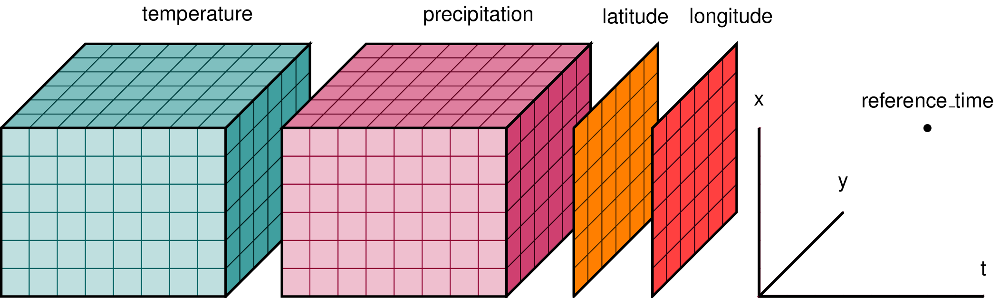

# Introduction to multidimensional datasets with `xarray`, `rioxarray` and using cloud data repositories

In this module, you will start working with the `Xarray`, an open source project and Python package that introduces labels in the form of dimensions, coordinates, and attributes on top of raw NumPy-like arrays, which allows for more intuitive, more concise, and less error-prone user experience.

## Prerequisites

We strongly recommend completing the [Intermediate training module](https://github.com/TNC-Geospatial-Conservation-Tech/ocs-2026-training/tree/main/2_Intermediate) for our data science training before taking on this Advanced module.

## About

This cookbook was derived and edited from the extensive knowledge base available on [Project Pythia](https://foundations.projectpythia.org). We would like to acknowledge the original author, [Kevin Tyle](https://github.com/ktyle). If you have specific questions about the inner workings of the packages used in this notebook, feel free to reach out to us directly or the original author.

### TNC Contributors for 2026 Spatial Data Science virtual training - Advanced Module

